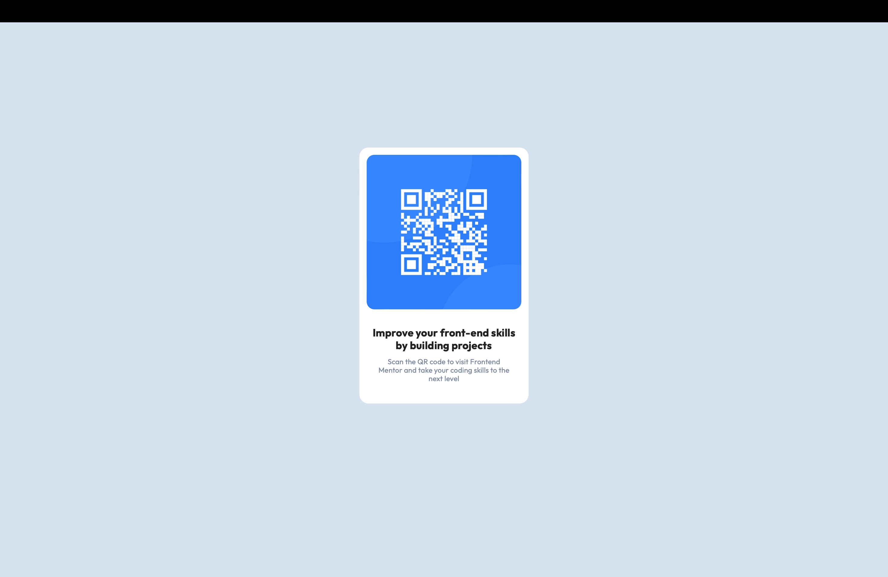

# Frontend Mentor - QR code component solution

## Overview 

### Screenshot 



### Links

- Solution URL: [Github](https://github.com/FrontendMentorTutorial/QR-code-Fundemental-)
- Live Site URL: [qr-component](https://6696c295d6b714000864aafa--qr-component-lojan.netlify.app)

## My process

### Built with

- Semantic HTML5 markup
- CSS custom properties
- [React](https://reactjs.org/) - JS library
- [Vite](https://vitejs.dev) - Development Environment
- [Styled Components](https://mui.com/material-ui/) - Component Library,


### What I learned

Introduced with React JS and MUI for react. A transition journey from AngularJS

- Learnt the fundementals of React + Vite
- Deployment utilizing netlify

### Continued development

Resuming with the following and on the prolong journey. My milestone to improve on the UI/UX and crafting an authentic design to tailor my portfolio.

Expected fields 
- Flexbox
- Screen Responsiveness
- Creative alignments 


### Useful resources

- [Example resource 1](https://www.example.com) - This helped me for XYZ reason. I really liked this pattern and will use it going forward.
- [Example resource 2](https://www.example.com) - This is an amazing article which helped me finally understand XYZ. I'd recommend it to anyone still learning this concept.


## Author
- Linkedin - [@Lojan Jayakumar](https://www.linkedin.com/in/lojan-jayakumar/)
- Frontend Mentor - [@Lojan_2003](https://www.frontendmentor.io/profile/Yikes23)
- Instagram - [@Lojan2318](https://www.instagram.com/lojan2318)

## Acknowledgments

This Project was a rudimentary exploration with reactJS and deployment methods, therefore the application was solely managed for experimentation purposes.


# React + TypeScript + Vite

This template provides a minimal setup to get React working in Vite with HMR and some ESLint rules.

Currently, two official plugins are available:

- [@vitejs/plugin-react](https://github.com/vitejs/vite-plugin-react/blob/main/packages/plugin-react/README.md) uses [Babel](https://babeljs.io/) for Fast Refresh
- [@vitejs/plugin-react-swc](https://github.com/vitejs/vite-plugin-react-swc) uses [SWC](https://swc.rs/) for Fast Refresh

## Expanding the ESLint configuration

If you are developing a production application, we recommend updating the configuration to enable type aware lint rules:

- Configure the top-level `parserOptions` property like this:

```js
export default {
  // other rules...
  parserOptions: {
    ecmaVersion: 'latest',
    sourceType: 'module',
    project: ['./tsconfig.json', './tsconfig.node.json'],
    tsconfigRootDir: __dirname,
  },
}
```

- Replace `plugin:@typescript-eslint/recommended` to `plugin:@typescript-eslint/recommended-type-checked` or `plugin:@typescript-eslint/strict-type-checked`
- Optionally add `plugin:@typescript-eslint/stylistic-type-checked`
- Install [eslint-plugin-react](https://github.com/jsx-eslint/eslint-plugin-react) and add `plugin:react/recommended` & `plugin:react/jsx-runtime` to the `extends` list

